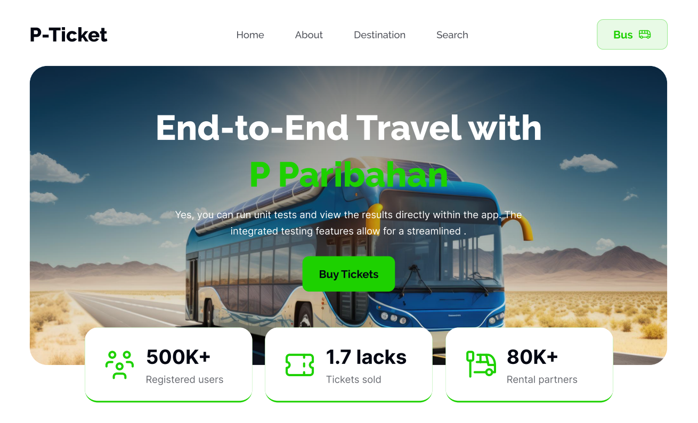

<h1 align="center">🚌 E-Bus Ticket Booking</h1>

  A clean, interactive bus ticket booking experience — select your seat, apply coupons, and confirm your ride with ease.

  
  
  
  

---

## 🧾 Overview

**E-Bus Ticket** is a front-end based bus reservation interface designed to mimic a real-life seat booking platform. It allows users to choose available seats, apply discounts via coupons, calculate fare dynamically, and confirm the booking with personal info. Clean UI and fast interaction are at its heart.

---

## ✨ Key Features

- 🚍 **Interactive Seat Selection**  
  - Click to book/unbook seats  
  - Selected seats turn green  
  - Maximum 4 seats can be booked at a time

- 💸 **Fare Calculator**  
  - Dynamic price updates with selected seat count  
  - Two working coupons: `NEW15` (15% off), `COUPLE20` (20% off)

- 🧾 **Passenger Info Form**  
  - Collects Name, Phone, and Email  
  - “Next” button shows success modal with booking confirmation

- ✅ **Responsive Design**  
  - Mobile, Tablet & Desktop friendly  
  - Minimal, modern, and accessible UI using **Tailwind CSS** + **DaisyUI**

---

## 📸 Preview

---

## 🔧 Tech Stack

| Technology | Description |
|------------|-------------|
| **HTML5** | Structured page layout |
| **Tailwind CSS** | Utility-first responsive styling |
| **DaisyUI** | Ready-made Tailwind UI components |
| **JavaScript (Vanilla)** | Seat logic, price calculation, and DOM manipulation |

---

## 🚦 How It Works

1. Select up to 4 available seats — they will turn green.
2. Fare is calculated and shown in the summary.
3. Apply coupon (`NEW15` or `COUPLE20`) to get discounted price.
4. Fill in passenger name, phone, and email.
5. Click “Next” ➝ A confirmation modal appears showing success.

---

## 🔮 Possible Future Enhancements
- Backend integration to store seat bookings
- Payment gateway
- Responsive PDF ticket generation
